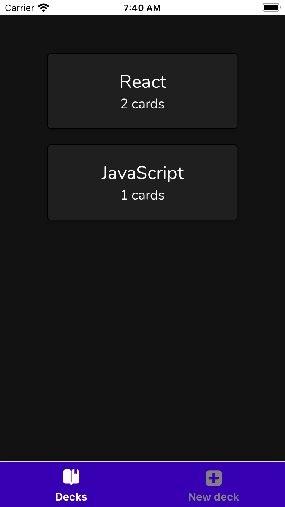
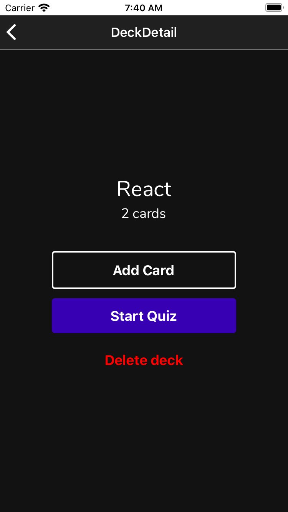
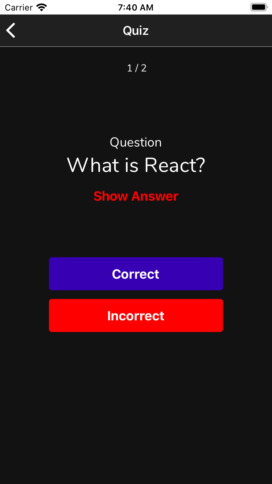

# Memory Flashcards

This app is one of the project required in the Udacity React Nanodegree program.

Memory Flashcards is a React Native app for iOS and Android that allows users to create decks, add cards and quiz themselves, built with Expo.







## Installation

Clone the repository

```bash
$ git clone https://github.com/james-priest/mobile-flashcards.git
```

Go to the project

```bash
$ cd mobile-flashcards
```

Install the dependencies

```bash
$ yarn
```

## Usage

The project can be run yarn

```bash
$ yarn start
```

Or

```bash
$ npm run start
```